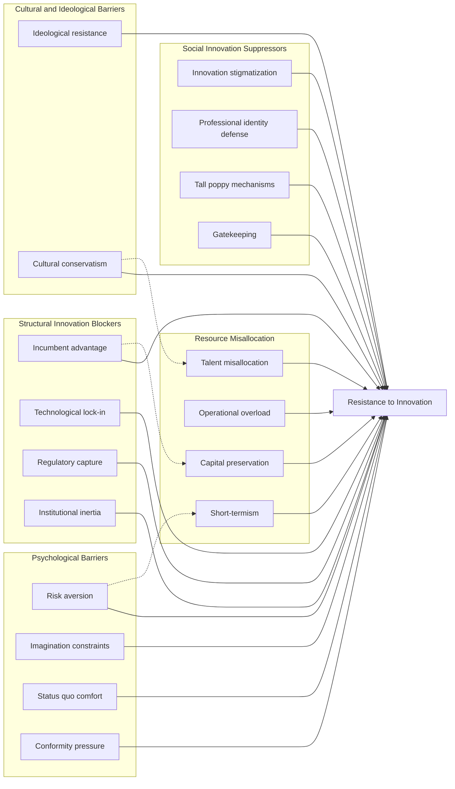

https://x.com/i/grok?conversation=1911096758597210121

NB there's a link to Thomas Kuhn and paradigm shifts

".. Intended to be comprehensive but not exhaustive..."

1. Psychological Barriers
- Risk aversion: Disproportionate fear of potential failures versus potential benefits.
- Imagination constraints: Difficulty visualizing and valuing significantly different futures.
- Status quo comfort: Preference for familiar problems over unfamiliar solutions.
- Conformity pressure: Tendency to adhere to group norms, stifling individual creativity.
    
2. Social Barriers
- Innovation stigmatization: Portraying disruptive ideas as dangerous, unrealistic, or irresponsible, often enforced through social sanctions.
- Professional identity defense: Resistance from experts whose status depends on existing paradigms.
- "Tall poppy" mechanisms: Punishment of those proposing or implementing radical changes.
- Gatekeeping: Control over access to resources, platforms, or opportunities to suppress innovation.
    
3. Structural Barriers
- Incumbent advantage: Existing players possess resources to resist or co-opt threats.
- Technological lock-in: Interdependent systems making change prohibitively expensive.
- Regulatory capture: Rules designed to protect established models rather than enable new ones.
- Institutional inertia: Resistance to change embedded in organizational structures and processes.
    
4. Resource Misallocation
- Short-termism: Prioritizing immediate returns over transformative potential.
- Operational overload: Innovative time and effort crowded out by maintaining status quo responsibilities.
- Capital preservation: Funding directed to proven models rather than paradigm-shifting possibilities.
- Talent misallocation: Concentration of skilled individuals in established areas, limiting innovation.
    
5. Cultural and Ideological Barriers
- Ideological resistance: Adherence to beliefs or doctrines that oppose change.
- Cultural conservatism: Preference for traditional practices and values, resisting new ideas.

